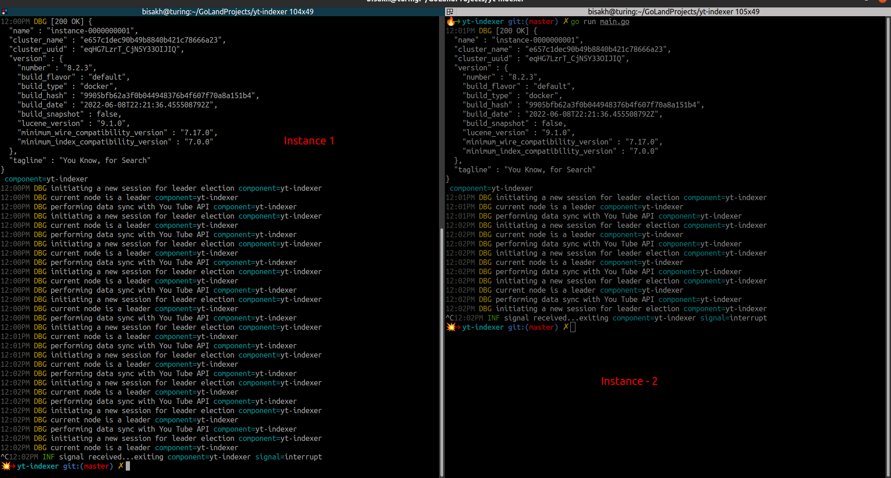

## YouTube-Elasticsearch-Indexer

Backend API to Query the Cached Response from YouTube Public Data API with a Leader Election mechanism and Full Text Search Capabilities.

### Tech Stack
- Golang (development language)
- Elasticsearch as Database with Full Text search capabilities
- YouTube Data V3 API
- etcd.io for raft based Leader election to optimize and scale the indexer.


### Package Tree View
<pre>
.
├── config.json     // config json
├── go.mod
├── go.sum
├── keystore        // API key store with key rotation capabilities on HTTP 403
│   ├── inmemstore.go
│   ├── inmemstore_test.go
│   └── store.go
├── leaderelection  // Leader Election Mechanism to optimize async data fetch in cluster
│   ├── elector.go
│   └── raft.go
├── main.go
├── README
├── server          // Server components with handlers and You Tube Data api fetch logic
│   ├── async_yt_data.go
│   ├── async_yt_data_test.go
│   ├── handlers.go
│   └── server.go
└── utils           // utilities like config parser
    └── config.go

</pre>

### Exposed APIs

1. `/api/v1/search/all`
   1. Method: HTTP GET
   2. Query Params:
      1. `pagination-size`: number of data elements returned per response. (Default: 25)
      2. `pagination-from`: the offset from which the `pagination-size` number of data points will be returned. (Default: 0)
   3. Examples:
      1. `GET /api/v1/search/all` - returns first 25 videos data (default).
      2. `GET /api/v1/search/all?pagination-from=10` - returns 25 videos data starting from 10+1
      3. `GET /api/v1/search/all?pagination-from=100&pagination-size=30` - returns 30 videos data starting from 100+1
2. `/api/v1/search`
   1. Method: HTTP GET
   2. Query Params:
      1. `q`: the query itself
   3. Examples:
      1. `GET /api/v1/search?q="tea how"` - returns matched videos' data after running a full text search on title and description.


### How it works
- The main program runs a background job to query and fetch the you tube api `based on current node's leader status`. The leader election provides an optimization over scalability without exhausting the rate limits of API keys.
   
- Support for adding multiple API keys and an in memory key store with key rotation.
- A GET API which returns the stored video data in a paginated response sorted in descending order of published datetime.
- A basic search API to search the stored videos using their title and description.

### How to build

1. Please run the docker script to build an image

  ```sh
  docker build -t yt-indexer -f dockerfile .
  ```

2. To run the container

```sh
docker network create yt-indexer-network # would be easy later to attach resources like elasticsearch container and etcd contianer
docker run [--network <host or yt-indexer-network>] -p 8880:8880 yt-indexer:latest
```

#### Required Dependencies

Please keep in mind to update the [config.json](./config.json) with the following three fields

1. keys
2. elasticsearch-config
3. etcd-config

### License

[APACHE LICENSE, VERSION 2.0](https://opensource.org/licenses/Apache-2.0)
